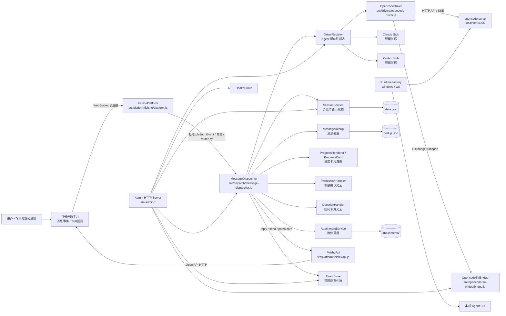
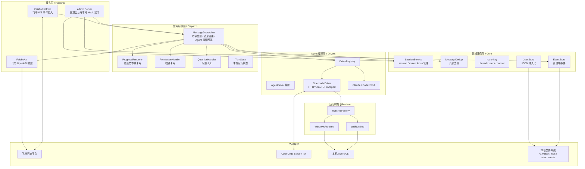
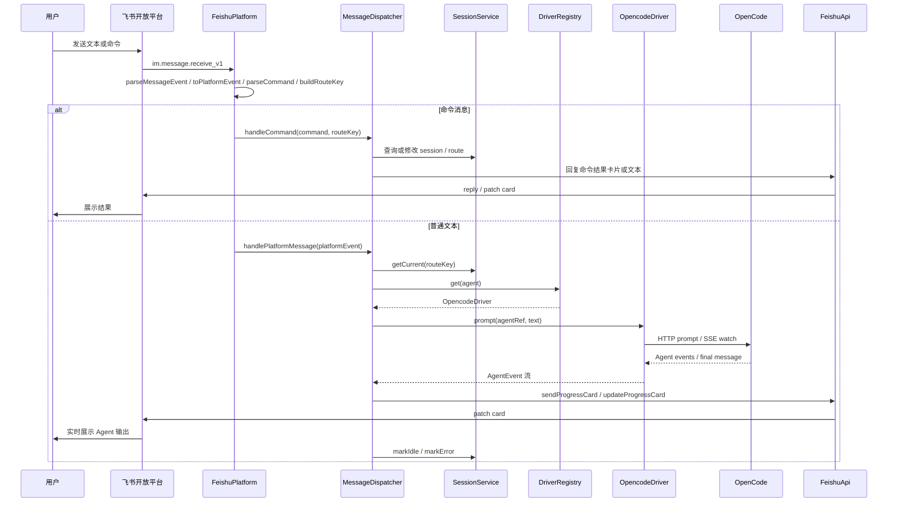
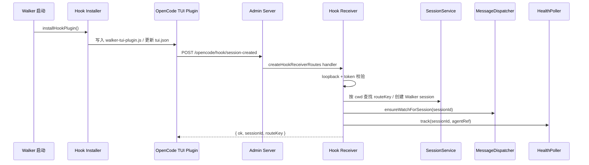
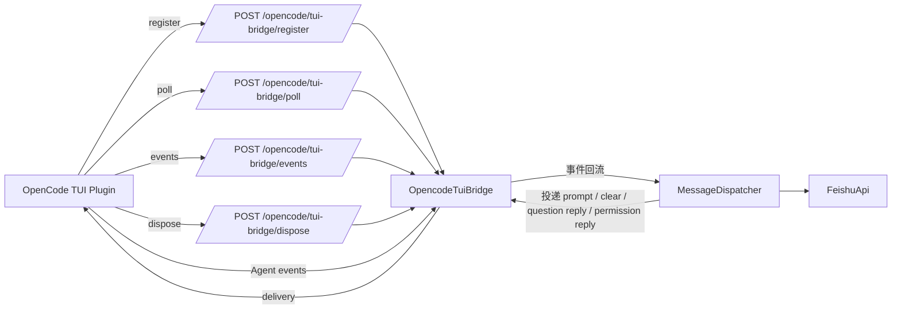

# Walker

飞书多 Agent CLI 桥接器 — 通过飞书长连接操控本机 opencode agent 会话（架构保留 Claude Code、Codex 等扩展点）。

[](LICENSE)
[](https://nodejs.org/)
[](test/)

## 文档

- [配置与环境变量](#配置) — 飞书凭据、Agent、运行时、超时等配置
- [命令列表](#命令) — 飞书交互命令
- [架构概览](#architecture) — 分层设计与数据流
- [贡献指南](CONTRIBUTING.md) — 开发环境、编码约定、提交流程
- [变更日志](CHANGELOG.md) — 版本历史与显著变更
- [许可证](LICENSE) — MIT

## 运行

### 全局安装（推荐）

```bash
npm install -g walker-bridge
walker
```

`walker` 命令前台运行，Ctrl+C / 关闭终端即停止。

### 从源码运行

```bash
git clone <repo>
cd walker
npm install
npm start
```

### 子命令

| 命令 | 说明 |
| --- | --- |
| `walker` | 前台运行（默认） |
| `walker start` | 后台守护进程启动 |
| `walker stop` | 停止后台进程 |
| `walker status` | 查看后台进程状态和最近日志 |
| `walker logs [N]` | 查看最近 N 行日志（默认 80） |
| `walker init [--data-dir <dir>]` | 初始化数据目录、模板配置和必要本地文件；不会覆盖已有配置 |
| `walker doctor` | 检查核心配置、飞书环境、OpenCode 和 provider 状态，输出问题与修复建议 |
| `walker providers list` | 列出内置 provider catalog 及本机检测状态 |
| `walker providers doctor <id>` | 诊断单个 provider，例如 `opencode`、`claude`、`codex`、`shell` |
| `walker help` | 显示帮助 |

运行前先配置 `.env`。日志同时输出到终端；后台模式额外写入 Walker 数据目录下的 `logs/walker.out.log` / `logs/walker.err.log`（默认 `~/.walker/logs/`，可通过 `WALKER_DATA_DIR` 调整）。

### 本地并行测试

如果已经通过 npm 全局安装启动了一个 Walker，又想在源码目录启动新版做验证，不要直接复用默认配置。至少隔离 Admin 端口、数据目录和 OpenCode hook，否则会出现端口占用、状态文件互相污染或用户级 hook 插件被后启动实例覆盖。

```powershell
$env:WALKER_ADMIN_PORT="8788"
$env:WALKER_DATA_DIR="H:\walker\.tmp\walker-dev"
$env:WALKER_OPENCODE_HOOK_ENABLED="false"
$env:WALKER_ADMIN_TOKEN="dev-test-token"
npm start
```

真实飞书消息测试建议只保留一个实例连接同一个飞书 App。两个 Walker 使用相同 `FEISHU_APP_ID` / `FEISHU_APP_SECRET` 时，可能同时消费同一条消息并各自回复，导致验证结果混乱。只验证 Admin API 或 WebSocket 时，可以临时清空飞书凭据，仅启动本地管理端。

## 配置

在项目根目录创建 `.env`：

```text
FEISHU_APP_ID=cli_xxxxxxxx
FEISHU_APP_SECRET=你的飞书应用密钥
WALKER_DEFAULT_AGENT=opencode
WALKER_DEFAULT_RUNTIME=windows
WALKER_DEFAULT_CWD=H:\walker
OPENCODE_SERVER_URL=http://localhost:4096
OPENCODE_SERVER_AUTOSTART=true
OPENCODE_CMD=opencode
FEISHU_ROUTE_MODE=thread
FEISHU_PROGRESS_STYLE=card
FEISHU_REACTION_EMOJI=OnIt
FEISHU_DONE_EMOJI=none
WALKER_PROMPT_HEARTBEAT_INITIAL_MS=30000
WALKER_PROMPT_HEARTBEAT_INTERVAL_MS=60000
WALKER_PROMPT_HEARTBEAT_STUCK_MS=300000
WALKER_MAX_TURN_TIME_MINS=0
WALKER_OPENCODE_HOOK_ENABLED=true
WALKER_OPENCODE_HEALTH_POLL_INTERVAL_MS=5000
WALKER_OPENCODE_EXIT_ACTION=cancel
WALKER_OPENCODE_NON_FOCUS_OUTPUT=true
```

飞书凭据通过环境变量或项目根目录的 `.env` 文件配置。

### 环境变量说明

| 变量                                      | 默认值         | 说明                                                                                                             |
| ----------------------------------------- | -------------- | ---------------------------------------------------------------------------------------------------------------- |
| `FEISHU_APP_ID`                           | 空             | 飞书应用 App ID（必填）                                                                                          |
| `FEISHU_APP_SECRET`                       | 空             | 飞书应用 App Secret（必填）                                                                                      |
| `FEISHU_ROUTE_MODE`                       | `thread`       | 路由模式：`thread`（按消息线程）、`user`（按用户）、`channel`（按群）                                            |
| `FEISHU_PROGRESS_STYLE`                   | `card`         | 进度样式：`card`（结构化卡片）或 `legacy`（逐条文本）                                                            |
| `FEISHU_REACTION_EMOJI`                   | `OnIt`         | 收到消息时表情回复，`none` 禁用                                                                                  |
| `FEISHU_DONE_EMOJI`                       | 空             | Agent 完成时表情回复，`none` 禁用                                                                                |
| `WALKER_DEFAULT_AGENT`                    | `opencode`     | 默认 Agent 类型                                                                                                  |
| `WALKER_DEFAULT_RUNTIME`                  | `windows`      | 运行时：`windows` 或 `wsl`                                                                                       |
| `WALKER_DEFAULT_CWD`                      | 当前目录       | Agent 工作目录                                                                                                   |
| `WALKER_DATA_DIR`                         | `~/.walker`    | 数据存储目录                                                                                                     |
| `WALKER_WSL_DISTRO`                       | `Ubuntu-24.04` | WSL 发行版名称                                                                                                   |
| `WALKER_PROMPT_HEARTBEAT_INITIAL_MS`      | `30000`        | prompt 开始后多久无事件时首次更新原进度卡片，单位毫秒；仅 `FEISHU_PROGRESS_STYLE=card` 时启用                    |
| `WALKER_PROMPT_HEARTBEAT_INTERVAL_MS`     | `60000`        | 首次心跳后的重复更新间隔，单位毫秒；心跳只更新原进度卡片，不发送普通群消息                                       |
| `WALKER_PROMPT_HEARTBEAT_STUCK_MS`        | `300000`       | 达到该时长后在原进度卡片提示任务可能卡住，单位毫秒                                                               |
| `WALKER_MAX_TURN_TIME_MINS`               | `0`            | 单轮 prompt 唯一硬截止时长，单位分钟；`0` 默认关闭，`>0` 时超时自动取消当前 turn，并抑制已取消或超时后的残留输出 |
| `OPENCODE_SERVER_URL`                     | 空             | opencode serve 地址，WSL 模式自动探测 IP                                                                         |
| `OPENCODE_SERVER_AUTOSTART`               | `true`         | opencode serve 未启动时自动启动                                                                                  |
| `OPENCODE_CMD`                            | `opencode`     | opencode CLI 命令名                                                                                              |
| `OPENCODE_MODEL`                          | 空             | 指定模型                                                                                                         |
| `OPENCODE_AGENT`                          | 空             | 指定 agent                                                                                                       |
| `OPENCODE_PROMPT_REQUEST_TIMEOUT_MS`      | `30000`        | HTTP prompt 提交超时，单位毫秒；`0` 关闭                                                                         |
| `OPENCODE_SSE_IDLE_TIMEOUT_MS`            | `300000`       | SSE 事件流空闲超时，收到任意 chunk 自动续期；`0` 关闭。未设置时以 `OPENCODE_PROMPT_TIMEOUT_MS` 为兼容输入        |
| `OPENCODE_RECOVERY_WINDOW_MS`             | `300000`       | SSE 断流后 polling 恢复的最长时间窗口，单位毫秒；`0` 禁用恢复直接失败                                            |
| `OPENCODE_SSE_OPEN_TIMEOUT_MS`            | `1000`         | SSE 建连超时，单位毫秒；`0` 关闭                                                                                 |
| `OPENCODE_TUI_LEASE_TIMEOUT_MS`           | `90000`        | TUI Bridge 租约超时，活跃 heartbeat 自动续期；`0` 关闭                                                           |
| `OPENCODE_TUI_HEARTBEAT_INTERVAL_MS`      | `30000`        | TUI plugin 心跳上报间隔，须小于 lease timeout                                                                    |
| `WALKER_OPENCODE_HOOK_ENABLED`            | `true`         | 是否启用 OpenCode plugin 自动安装和 hook 接收。设为 `false` 退回手动 `/attach` 模式                              |
| `WALKER_OPENCODE_HEALTH_POLL_INTERVAL_MS` | `5000`         | 心跳轮询 `/global/health` 间隔，单位毫秒                                                                         |
| `WALKER_OPENCODE_EXIT_ACTION`             | `cancel`       | OpenCode 退出动作。`cancel` 取消该 session turn 并从 route 移除；`none` 只记录 detached                          |
| `WALKER_OPENCODE_NON_FOCUS_OUTPUT`        | `true`         | 非焦点 session SSE 事件是否主动回卡片到群里。`false` 时静默                                                      |

## OpenCode 自动纳入

Walker 启动时自动安装 TUI bridge plugin 到 `~/.config/opencode/walker-tui-plugin.js`，并注册到 `~/.config/opencode/tui.json` 的 `plugin` 数组；已存在且内容一致则跳过，内容变化时更新。

工作流程：

1. Walker 启动时写入 plugin 文件并更新 `tui.json`（内容一致则跳过，避免无谓写盘）；同时清理旧版 hook plugin。
2. 用户在本机终端照常启动 `opencode`。
3. OpenCode 加载全局 plugin，触发 `session.created` 事件。
4. plugin 上报 `{ opencodeBaseUrl, sessionId, cwd }` 给 Walker 的 `POST /opencode/hook/session-created` 端点。
5. Walker 按 `cwd` 找到 routeKey，创建 Walker session，加入 route 的 sessions 列表。
6. 全程无飞书命令干预，用户照常启动 opencode 即可自动纳入。

安全约束：

- 只接受本机 loopback 请求（`127.0.0.1` / `::1` / `::ffff:127.0.0.1`），非本机请求返回 403。
- 复用现有 admin token 保护（`WALKER_ADMIN_TOKEN`）；未配置 token 时仍限制 loopback。
- plugin 文件内置 admin token（`WALKER_ADMIN_TOKEN`）用于鉴权，Walker 地址硬编码为 `127.0.0.1:<port>`。
- Walker 不可达时 plugin 静默忽略，不影响 OpenCode 正常使用。

`WALKER_OPENCODE_HOOK_ENABLED=false` 时，Walker 不安装 plugin，退回手动 `/attach` 模式。

## 1:N Session 路由

同一 `cwd` 启动多个 OpenCode 处理不同任务时，一个飞书群（routeKey）可绑定多个 session，通过"焦点 session"机制保证消息精准路由。

路由结构：

- route 从 `{ routeKey: sessionId }` 升级为 `{ focusSessionId, sessions[], cwd, updatedAt }`，旧格式自动迁移。
- session 本身不变，仍 1 session : 1 agentRef `{ opencodeSessionId, serverUrl }`。
- `getCurrent(routeKey)` 返回焦点 session。

消息路由：

- 普通消息发给焦点 session，输出回到原 routeKey。
- 非焦点 session 的 SSE 事件主动回卡片到群里，带 `[session: wks_N]` 标识区分来源。
- `WALKER_OPENCODE_NON_FOCUS_OUTPUT=false` 时，非焦点 session 输出静默不回群。

焦点切换：

- `/use <id>` 切换焦点（session 必须在当前 route 的 sessions 列表中）。
- `/use off` 移除焦点 session（保留 route 中其他 session）。
- `/list` 卡片的"设为焦点"按钮也可切换焦点。

## OpenCode 退出行为

每个 hook 纳入的 session 独立心跳轮询 OpenCode 的 `/global/health` 端点检测存活。连续 2 次检查失败判定该 session detached。

detached 后的处理：

- `WALKER_OPENCODE_EXIT_ACTION=cancel`（默认）：取消该 session 的 running turn，从 route 移除该 session，停止 SSE watch 和心跳轮询。
- `WALKER_OPENCODE_EXIT_ACTION=none`：只记录 detached，不取消 turn，不主动移除。
- 若 detached 的 session 是焦点，自动切换焦点到 route 中下一个活跃 session。
- 没有 running turn 时，退出只记录 detached，不报错。
- 不 stop/delete Walker session，不解绑 route。

心跳间隔由 `WALKER_OPENCODE_HEALTH_POLL_INTERVAL_MS` 控制，退出动作由 `WALKER_OPENCODE_EXIT_ACTION` 控制。

## 飞书后台要求

- 应用类型：自建应用
- 已开启机器人能力
- 事件订阅方式：`使用长连接接收事件/回调`
- 已订阅 `im.message.receive_v1`
- 权限包含单聊或群聊消息读取能力
- 发布应用版本后生效
- 机器人被拉进目标群或用户直接单聊

## 命令

| 命令                   | 说明                                                                                                                                                       |
| ---------------------- | ---------------------------------------------------------------------------------------------------------------------------------------------------------- |
| `/new [agent] [title] [--cwd <path>]` | 创建新 Walker session 并绑定当前会话，可显式指定项目工作目录                                                                                   |
| `/list`                | 列出当前 route 下所有 session（含卡片"设为焦点"按钮）                                                                                                      |
| `/use <session_id>`    | 切换当前 route 的焦点到指定 session                                                                                                                        |
| `/use off`             | 移除当前会话的焦点 session（保留 route 中其他 session）                                                                                                    |
| `/current`             | 查看当前绑定的 session                                                                                                                                     |
| `/status`              | 查看当前会话绑定的 Walker session、Agent、状态、OpenCode session、模型、工作目录、当前 turn 运行状态、运行时长、最近事件时间和后台 watch 状态              |
| `/ps`                  | `/status` 的等价别名                                                                                                                                       |
| `/cancel`              | 取消当前正在执行的 turn，保留 Walker session 并回到 `idle`                                                                                                 |
| `/clear`               | 在当前 OpenCode TUI 会话新建空上下文并保留旧会话（仅适用于已连接且空闲的 OpenCode TUI；运行中请先 `/cancel`；旧会话可通过 `/list` 查看、`/use <id>` 恢复） |
| `/stop`                | 停止当前 session                                                                                                                                           |
| `/delete <session_id>` | 删除指定 session                                                                                                                                           |
| `/agents`              | 列出可用 Agent 类型                                                                                                                                        |
| `/help`                | 命令帮助                                                                                                                                                   |

Walker 启动时会更新 OpenCode TUI plugin。若更新涉及 `/clear` 等桥接协议，已运行的 OpenCode TUI 不会热加载新 plugin，必须退出并重新启动该 TUI；仅重启 Walker 不足以使旧 TUI 获得新能力。

## 长任务控制

- 进度卡片心跳由 `WALKER_PROMPT_HEARTBEAT_INITIAL_MS`、`WALKER_PROMPT_HEARTBEAT_INTERVAL_MS` 和 `WALKER_PROMPT_HEARTBEAT_STUCK_MS` 控制；心跳只更新原进度卡片，不发送普通群消息。
- 非 card 进度模式不启用卡片心跳；例如 `FEISHU_PROGRESS_STYLE=legacy` 时不会发送卡片心跳更新。
- `/cancel` 用于取消当前绑定 session 的正在执行 turn。第一版对 OpenCode 可复用 driver stop 能力，但 Walker session 会保留并回到 `idle`，不同于 `/stop` 停止整个 session。
- `WALKER_MAX_TURN_TIME_MINS` 是单轮唯一硬截止；`0` 默认关闭，`>0` 时超时自动取消该 turn，并抑制已取消或超时后的残留输出。
- HTTP/SSE transport 使用独立超时：`OPENCODE_SSE_OPEN_TIMEOUT_MS`（建连）、`OPENCODE_PROMPT_REQUEST_TIMEOUT_MS`（提交）、`OPENCODE_SSE_IDLE_TIMEOUT_MS`（空闲，收到 chunk 自动续期）；均可设为 `0` 关闭。SSE 断流后自动 polling 恢复最终结果。
- TUI Bridge 使用租约协议：`OPENCODE_TUI_LEASE_TIMEOUT_MS`（租约，heartbeat 续期）、`OPENCODE_TUI_HEARTBEAT_INTERVAL_MS`（心跳间隔）。旧 `OPENCODE_PROMPT_TIMEOUT_MS` 已废弃，仅作为 `OPENCODE_SSE_IDLE_TIMEOUT_MS` 的兼容输入。

## Agent 扩展

| Agent      | 状态       | 说明                                    |
| ---------- | ---------- | --------------------------------------- |
| `opencode` | P0 已实现  | 通过 `opencode serve` HTTP API/SSE 控制 |
| `claude`   | 预留扩展点 | Claude Code CLI，未来实现               |
| `codex`    | 预留扩展点 | Codex CLI，未来实现                     |

## Runtime

- `windows`：本机直接运行 Agent CLI
- `wsl`：通过 `wsl.exe -d <distro>` 在 WSL 中运行 Agent CLI

WSL 模式下自动探测 WSL IP 构建 server URL，也可通过 `OPENCODE_SERVER_URL` 手动指定。

## 数据存储

Walker 数据默认存储在 `~/.walker/` 目录下，也可通过 `WALKER_DATA_DIR` 指定：

- `state.json`：Walker session、飞书 routeKey 绑定、焦点 session 等状态
- `dedup.json`：飞书消息去重窗口
- `attachments/`：入站附件文件
- `logs/`：前台或守护进程运行日志

## Admin API v1

Admin API v1 提供稳定的本地 JSON 接口，默认挂载在 Admin HTTP Server 上，和管理后台复用 `WALKER_ADMIN_TOKEN`。配置 token 后，请使用 Bearer token 调用：

```bash
curl -H "Authorization: Bearer dev-test-token" http://127.0.0.1:8787/api/v1/sessions
```

统一响应格式：

```json
{
  "ok": true,
  "data": {}
}
```

错误响应：

```json
{
  "ok": false,
  "error": {
    "code": "BAD_REQUEST",
    "message": "错误说明",
    "details": {}
  }
}
```

核心端点：

| 方法与路径 | 说明 |
| --- | --- |
| `GET /api/v1/providers` | 返回内置 provider catalog 与本机检测状态 |
| `GET /api/v1/providers/:id/doctor` | 诊断单个 provider，例如 `opencode` |
| `GET /api/v1/sessions` | 列出 session 安全摘要 |
| `POST /api/v1/sessions` | 创建 session，body 复用 Admin session 创建参数 |
| `GET /api/v1/sessions/:id` | 获取单个 session 安全摘要 |
| `POST /api/v1/sessions/:id/stop` | 停止 session |
| `POST /api/v1/sessions/:id/cancel` | 取消 session 当前执行，当前实现复用 stop 逻辑 |
| `DELETE /api/v1/sessions/:id` | 删除 session |
| `GET /api/v1/routes` | 列出 route、焦点 session 和健康摘要 |
| `GET /api/v1/routes/:routeKey` | 获取单个 route 摘要 |
| `POST /api/v1/routes/:routeKey/focus` | 设置焦点 session，body 需包含 `sessionId` |
| `POST /api/v1/routes/:routeKey/unfocus` | 移除 route 绑定 |
| `POST /api/v1/prompt` | 向 `sessionId` 或 `routeKey` 的焦点 session 发送 prompt |
| `GET /api/v1/events` | 查询历史事件，支持 `limit`、`level`、`type`、`sessionId`、`routeKey`、`after` |
| `GET /api/v1/metrics` | 获取事件指标摘要 |

发送 prompt 示例：

```bash
curl -X POST http://127.0.0.1:8787/api/v1/prompt \
  -H "Authorization: Bearer dev-test-token" \
  -H "Content-Type: application/json" \
  -d '{"routeKey":"feishu:oc_xxx:root:om_xxx","text":"继续总结当前任务"}'
```

API 响应会对 token、secret、password、credential、api key 等敏感字段做脱敏。`/api/v1` 是面向脚本和外部本地集成的稳定接口；`/api/admin` 仍服务管理后台页面和既有内部工具。

### WebSocket 事件流

实时事件流地址为 `ws://127.0.0.1:8787/api/v1/events/stream`，鉴权同样复用 `WALKER_ADMIN_TOKEN`。连接建立后发送订阅消息：

```json
{
  "type": "subscribe",
  "filter": {
    "routeKey": "feishu:oc_xxx:root:om_xxx",
    "level": "info"
  }
}
```

支持的过滤字段为 `sessionId`、`routeKey`、`level`、`type`。服务端确认订阅后返回：

```json
{
  "type": "subscribed",
  "filter": {
    "routeKey": "feishu:oc_xxx:root:om_xxx",
    "level": "info"
  }
}
```

之后新写入 eventStore 的事件会以如下格式推送：

```json
{
  "type": "event",
  "event": {
    "type": "platform.message_received",
    "level": "info",
    "routeKey": "feishu:oc_xxx:root:om_xxx",
    "message": "platform message received"
  }
}
```

事件流只推送连接建立后的新事件；需要查询历史事件时使用 `GET /api/v1/events`。服务端会做 Origin 校验、心跳、payload 大小限制、连续非法消息关闭和敏感字段脱敏。

## Architecture

Walker 是一个 Node.js 单进程 IM-to-Agent 桥接器：飞书开放平台通过长连接把消息和卡片交互推送给 Walker，Walker 根据 routeKey 找到当前焦点 session，把用户输入交给本机 Agent Driver，再将 Agent 事件实时回写到飞书文本或卡片。

### PlatformDriver 边界

`src/platforms/` 定义轻量平台抽象：`PlatformDriver` 只负责平台接入边界和发送代理，标准消息事件字段固定为 `platform`、`type`、`messageId`、`routeKey`、`userId`、`text`、`attachments`、`raw`。`MessageDispatcher.handlePlatformMessage(event)` 会先校验这些字段，再复用既有消息去重、route、session 和 turn 状态机；无效事件返回 `BAD_REQUEST`，不会调用 Agent driver。

`PlatformRegistry` 管理平台 driver 实例和启动状态，但本版本只提供飞书轻 adapter，不注册、不启动 Telegram、Slack 等真实外部平台接入，也不新增第三方平台运行时依赖。`FeishuPlatformDriver` 把飞书 `im.message.receive_v1` 转为标准事件，并代理 `sendMessage`、`updateMessage`、`sendCard`、`uploadAttachment` 等能力；发送失败和 adapter 错误会记录为 `platform.delivery_failed` / `platform.adapter_error` 日志或事件。

事件语义：`platform.message_received` 只在标准事件进入 `MessageDispatcher.handlePlatformMessage(event)` 并准备复用业务状态机时记录。adapter 成功转换不再记录同名事件，避免同一条飞书消息在 `/api/v1/events` 或 WebSocket 事件流中出现重复的 `platform.message_received`。如果需要观察 adapter 转换失败，请关注 `platform.adapter_error`。

兼容说明：现有飞书 WebSocket 长连接、卡片、附件、命令、权限和问题处理入口保持可用；`src/platform/feishu/platform.js` 内部经 adapter 生成标准事件后仍回到原有 `onMessage` / `onCardAction` 回调形状，因此不需要迁移既有 `.env`、CLI 子命令或 Admin API。

日常使用方式保持不变：先运行 `walker init` 准备本地数据目录和模板配置，再用 `walker doctor` 检查核心环境、飞书配置和 provider 状态，最后运行 `walker` 或 `walker start` 启动飞书长连接。管理端 `/api/v1/events/stream` WebSocket 事件流与 Admin API 继续复用 `WALKER_ADMIN_TOKEN` 安全边界。



### 分层设计



### 启动流程

```mermaid
flowchart TD
  CLI[walker CLI<br/>src/index.js] --> Config[读取 env / .env<br/>src/config/env.js]
  Config --> Bootstrap[createApp(config)<br/>src/app/bootstrap.js]

  Bootstrap --> DataDir[解析 WALKER_DATA_DIR]
  Bootstrap --> StateStore[JsonStore(state.json)]
  Bootstrap --> SessionService[SessionService]
  Bootstrap --> RuntimeFactory[createRuntime<br/>windows-runtime / wsl-runtime]
  Bootstrap --> TuiBridge[OpencodeTuiBridge]
  Bootstrap --> OpencodeDriver[OpencodeDriver]
  Bootstrap --> Registry[DriverRegistry]
  Bootstrap --> Dedup[MessageDedup + dedup.json]
  Bootstrap --> Dispatcher[MessageDispatcher]
  Bootstrap --> Platform[FeishuPlatform]
  Bootstrap --> AdminServer[AdminServer]
  Bootstrap --> HealthPoller[OpenCode HealthPoller]
  Bootstrap --> HookInstaller[OpenCode TUI Plugin Installer]

  Bootstrap --> Start[start()]
  Start --> Recover[恢复 running session 为 idle<br/>清理孤儿 route]
  Start --> InstallPlugin[安装 / 更新 OpenCode TUI plugin]
  Start --> StartFeishu[启动飞书 WSClient]
  Start --> StartAdmin[启动 Admin HTTP Server]
  Start --> RestoreHealth[恢复 OpenCode 健康轮询]
```

### 消息处理时序



### OpenCode 自动纳入

Walker 启动时会自动安装 OpenCode TUI plugin。用户在本机终端启动 `opencode` 后，plugin 会通过本地 Admin HTTP 接口把 OpenCode session 上报给 Walker，Walker 再按 `cwd` 自动纳入对应 route。



### TUI Bridge 通信



### 关键模块职责

| 模块 | 路径 | 职责 |
| --- | --- | --- |
| CLI 入口 | `src/index.js` | 处理 `walker`、`start`、`stop`、`status`、`logs`、`help` 等命令 |
| 应用组装 | `src/app/bootstrap.js` | 创建并连接平台、调度器、驱动、运行时、管理后台、健康轮询 |
| 飞书接入 | `src/platform/feishu/*` | 飞书 WS 事件接收、命令解析、卡片和消息发送 |
| 消息调度 | `src/dispatch/message-dispatcher.js` | 处理命令、普通消息、Agent 事件、进度卡片、权限和提问交互 |
| 会话服务 | `src/core/session-service.js` | 管理 session、routeKey、焦点 session、状态恢复与清理 |
| Agent 驱动 | `src/drivers/*` | 抽象多 Agent 驱动；当前主要实现 OpenCode |
| OpenCode Driver | `src/drivers/opencode-driver.js` | 通过 OpenCode HTTP/SSE 或 TUI Bridge 控制会话 |
| TUI Bridge | `src/opencode-tui-bridge/*` | 与 OpenCode TUI plugin 通过本地 HTTP 轮询协议通信 |
| Hook 接收 | `src/opencode-hook/*` | 自动纳入本机启动的 OpenCode session |
| Admin 后台 | `src/admin/*` | 本地管理 UI、状态诊断、配置、路由、工具接口 |
| Runtime | `src/runtime/*` | Windows / WSL 运行时抽象 |
| 持久化 | `src/core/json-store.js` | JSON 文件读写封装 |

### 架构要点

- 飞书长连接（WSClient）接收消息、卡片回调和 reaction 事件。
- `MessageDedup` 提供 5 分钟去重窗口，避免飞书重复投递造成重复 prompt。
- routeKey 支持 `thread`、`user`、`channel` 三种路由模式。
- 1:N session 路由允许同一 routeKey 绑定多个 session，并通过焦点 session 接收普通消息。
- OpenCode hook plugin 自动安装，用户本机启动 OpenCode 后可自动纳入 Walker，无需飞书命令干预。
- 心跳轮询检测 OpenCode detached，并按配置自动取消 turn、移除 route 或切换焦点。
- `AgentDriver` 抽象保留多 CLI 扩展点，当前 `opencode` 已实现，`claude`、`codex` 为预留 stub。
- `ProgressCard` 支持结构化卡片实时更新，也可按配置退回 legacy 文本进度。

## 贡献

欢迎参与本项目！请阅读 [CONTRIBUTING.md](CONTRIBUTING.md) 了解开发环境、编码约定和提交流程。

## 变更日志

详见 [CHANGELOG.md](CHANGELOG.md)。

## 许可证

[MIT](LICENSE) © 2026 Walker Contributors
